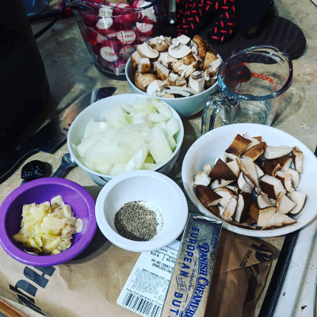
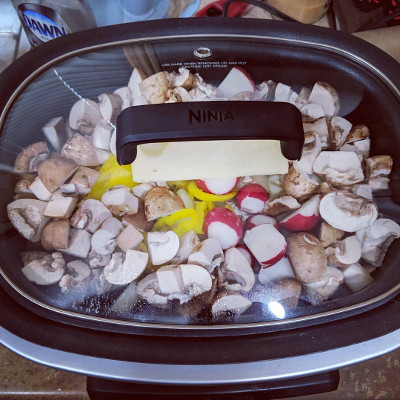
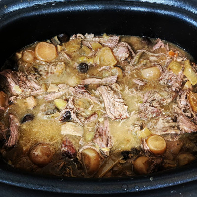

[Recipes](..) > [Main Courses](.) > Chuck Roast

# Chuck Roast

## Ingredients
| Amount   | Ingredient                      |
|----------|---------------------------------|
| 3.5 lb   | Chuck Roast                     |
| 1 small  | Yellow Onion, roughly chopped   |
| 1 cup    | Mushrooms, roughly chopped      |
| 2 cup    | Radishes, roughly chopped       |
| 1 cup    | Pepperoncini Peppers            |
| 6 cloves | Garlic, thinly sliced           |
| 1 stick  | Unsalted Butter                 |
| 1 tsp    | Better Than Bouillon Beef Roast |
| 1 pack   | Ranch Dressing Mix              |
| 1/2 tsp  | Salt                            |
| 1/2 tsp  | Pepper                          |

## Instructions
1. (Optional) Pat roast dry. Sear roast on all sides. Remember to get a good
crust, or it isn't worth doing the sear.
2. Add roast to slow cooker. Spread the bouillon paste evenly over the top of
the roast. Distribute the slices of garlic evenly on top of the roast. Cover the
roast with the ranch dressing mix. Gently add the rest of the ingredients.
3. Cook on low for 8 hours or high for 6 hours.
