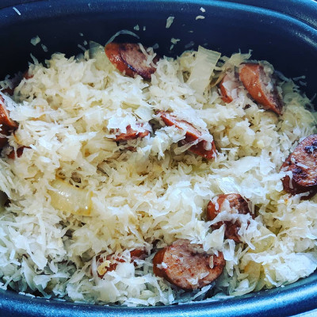

[Recipes](..) > [Main Courses](.) > Kielbasa & Sauerkraut

# Kielbasa & Sauerkraut

## Ingredients

| Amount   | Ingredient                     |
|----------|--------------------------------|
| 2 lb     | Sauerkraut, rinsed and drained |
| 2 lb     | Kielbasa, 1/2 inch slices      |
| 1 medium | Yellow Onion, thickly sliced   |
| 6 cloves | Garlic, thinly sliced          |
| 1/2 cup  | Water                          |
| 2 tsp    | Better Than Bouillon Chicken   |
| 2 tbsp   | Unsalted Butter                |

## Instructions
1. Add sauerkraut to slow cooker.
2. (Optional) Sear the kielbasa. Add to slow cooker.
3. Add 1 tbsp butter to preheated pan. Cook onions until well browned, but not
caramelized. Add the rest of the butter. Add garlic, cook until fragrant.
4. Add all ingredients to slow cooker. Mix well. Cook on high for 6 hours.
