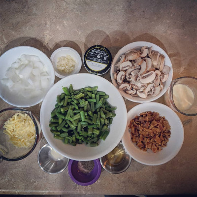
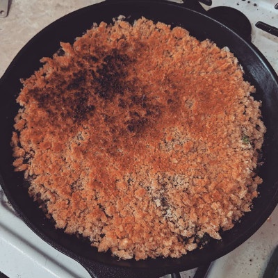

[Recipes](/recipes/) > [Sides](/recipes/sides/) > Cheesy Bacon Green Bean Casserole

# Cheesy Bacon Green Bean Casserole

## Ingredients

| Amount      | Ingredient                              |
|-------------|-----------------------------------------|
| 3 cups      | Cooked Green Beans                      |
| 1/2 cup     | Shredded White Cheddar                  |
| 1 small     | Onion, chopped                          |
| 8oz         | Baby Bella Mushrooms, chopped           |
| 6 slices    | Bacon, cooked, chopped, grease reserved |
| 4 oz        | Pork rinds, crushed                     |
| 1/2 cup     | Heavy Whipping Cream                    |
| 1 tsp       | Better Than Bouillon Chicken            |
| 1/2 cup     | Water                                   |
| 1/2 tsp     | Xanthan Gum                             |
| 1/2 tsp     | Salt                                    |
| 1/2 tsp     | Pepper                                  |

## Instructions
1. Add 1 tbsp reserved bacon grease to pan and preheat. Add mushrooms. Cook
mushrooms until wet. Continue until water has evaporated and pan is dry.
2. Add another tbsp of bacon grease. Add onions. Cook until onions are
translucent.
3. Add garlic. Cook until fragrant.
4. Add water, heavy whipping cream, and bouillon. Bring to simmer and simmer for
15 minutes. Stir every 5 minutes.
5. Add xanthan gum. Stir while heating until it is the thickness of your liking.
6. Turn off heat, add cheese, and stir until it is all mixed well and cheese is
completely melted.
7. Add everything to a large bowl. Mix well. Transfer to a baking dish of your
choice. Cover in crushed pork rinds.
8. Bake at 350 degrees until heated through, about 20 minutes.
9. (Optional) Broil another minute or two to brown the top.
